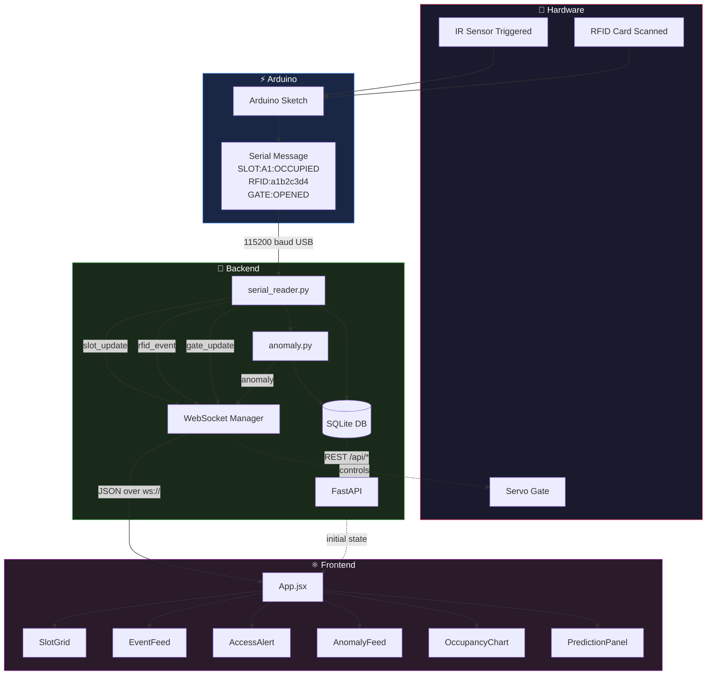
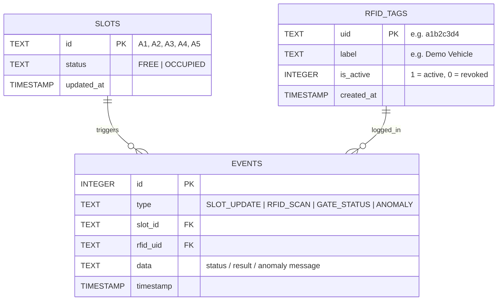
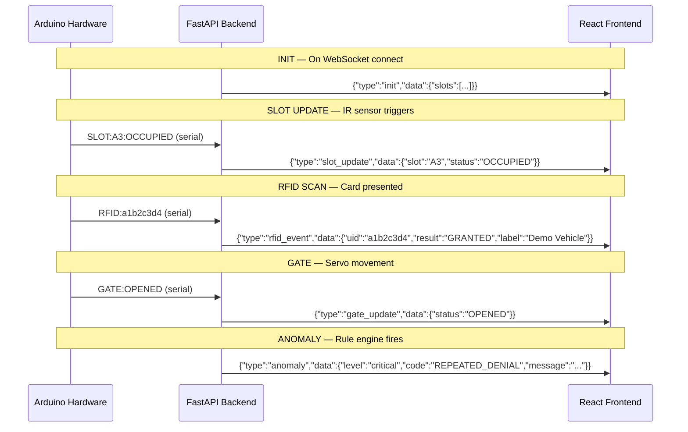
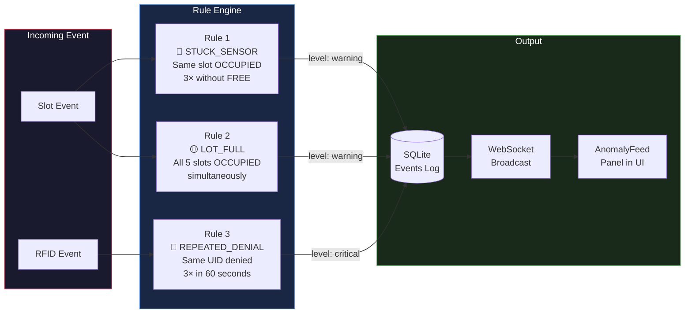
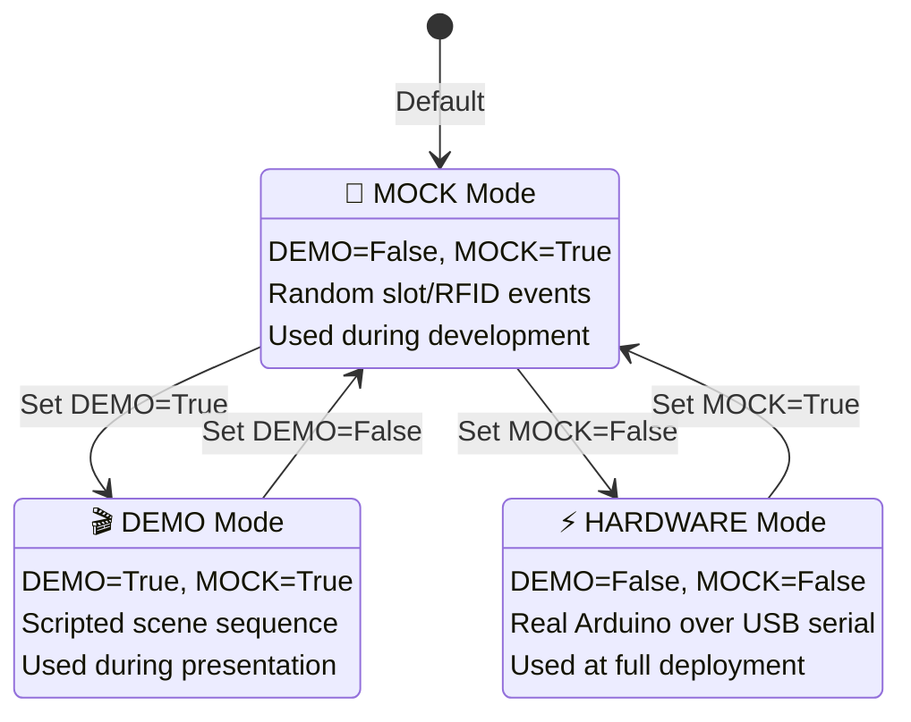

<div align="center">

```
██╗   ██╗██████╗ ██████╗  █████╗ ███╗   ██╗    ███████╗██╗      ██████╗ ██╗    ██╗
██║   ██║██╔══██╗██╔══██╗██╔══██╗████╗  ██║    ██╔════╝██║     ██╔═══██╗██║    ██║
██║   ██║██████╔╝██████╔╝███████║██╔██╗ ██║    █████╗  ██║     ██║   ██║██║ █╗ ██║
██║   ██║██╔══██╗██╔══██╗██╔══██║██║╚██╗██║    ██╔══╝  ██║     ██║   ██║██║███╗██║
╚██████╔╝██║  ██║██████╔╝██║  ██║██║ ╚████║    ██║     ███████╗╚██████╔╝╚███╔███╔╝
 ╚═════╝ ╚═╝  ╚═╝╚═════╝ ╚═╝  ╚═╝╚═╝  ╚═══╝   ╚═╝     ╚══════╝ ╚═════╝  ╚══╝╚══╝ 
```

**Smart Parking Management System — IoT + Real-Time Dashboard**

[](https://python.org)
[](https://fastapi.tiangolo.com)
[](https://react.dev)
[](https://tailwindcss.com)
[](https://sqlite.org)
[](https://developer.mozilla.org/en-US/docs/Web/API/WebSocket)
[](https://arduino.cc)

> **Urban Flow** transforms conventional parking lots into intelligent, connected infrastructure.
> IR sensors detect vehicles in real-time, RFID cards authenticate entry, and a servo-controlled gate responds — all streamed live to a premium web dashboard.

</div>

---

## 📋 Table of Contents

- [Live Demo Features](#-live-demo-features)
- [System Architecture](#-system-architecture)
- [Data Flow Diagram](#-data-flow-diagram)
- [Hardware Network Diagram](#-hardware-network-diagram)
- [Database Schema](#-database-schema)
- [API Reference](#-api-reference)
- [WebSocket Event Protocol](#-websocket-event-protocol)
- [Anomaly Detection Engine](#-anomaly-detection-engine)
- [Frontend Component Tree](#-frontend-component-tree)
- [Deployment Modes](#-deployment-modes)
- [Quick Start](#-quick-start)
- [Demo Day Checklist](#-demo-day-checklist)
- [File Structure](#-file-structure)

---

## ✨ Live Demo Features

| Feature | Description | Technology |
|---------|-------------|------------|
| 🚗 **Live Slot Monitoring** | Each parking bay shows real-time OCCUPIED/FREE state with car animation | IR Sensor + WebSocket |
| 🔐 **RFID Access Control** | Cards authenticated against DB; gate servo opens/closes on result | RC522 + SQLite |
| 🚨 **Visual Access Alerts** | Full-screen banner + ambient background colour shift on every scan | React State + CSS |
| 📊 **Peak Hour Analytics** | Bar chart of vehicle entries per hour, seeded with historical data | Chart.js + SQLite |
| 🤖 **AI Prediction Panel** | Predicts occupancy for the next 30 minutes using trend analysis | Python heuristics |
| ⚠️ **Anomaly Detection** | Detects sensor faults, lot saturation, and intrusion attempts in real-time | Rule Engine + WebSocket |
| 💳 **RFID Management UI** | Web modal to register and view authorised vehicles without touching DB | REST API + React |
| 🎬 **Demo Mode** | Scripted presentation sequence for flawless hackathon delivery | `serial_reader.py` |

---

## 🏗️ System Architecture

```
┌─────────────────────────────────────────────────────────────────────────────┐
│                         URBAN FLOW SYSTEM OVERVIEW                         │
└─────────────────────────────────────────────────────────────────────────────┘

  ┌──────────────────────────────────────┐
  │            HARDWARE LAYER            │
  │                                      │
  │  ┌──────────┐  ┌──────────────────┐  │
  │  │ IR Sensor│  │  RC522 RFID      │  │
  │  │ × 5 bays │  │  Reader + Cards  │  │
  │  └────┬─────┘  └────────┬─────────┘  │
  │       │                 │            │
  │       └────────┬────────┘            │
  │                │                     │
  │         ┌──────▼──────┐              │
  │         │   Arduino   │              │
  │         │  Uno/Mega   │◄────────────►│──── Servo Motor (Gate)
  │         │   Sketch    │              │
  │         └──────┬──────┘              │
  └────────────────┼────────────────────┘
                   │ USB Serial (115200 baud)
  ┌────────────────▼────────────────────┐
  │           BACKEND LAYER             │
  │            (Python)                 │
  │                                     │
  │  ┌─────────────────────────────┐    │
  │  │      serial_reader.py       │    │
  │  │  • Reads serial lines       │    │
  │  │  • Parses SLOT/RFID/GATE    │    │
  │  │  • Calls anomaly engine     │    │
  │  └──────────────┬──────────────┘    │
  │                 │                   │
  │  ┌──────────────▼──────────────┐    │
  │  │         anomaly.py          │    │
  │  │  • Stuck sensor detection   │    │
  │  │  • Lot full alert           │    │
  │  │  • Intrusion detection      │    │
  │  └──────────────┬──────────────┘    │
  │                 │                   │
  │  ┌──────────────▼──────────────┐    │
  │  │          main.py            │    │
  │  │       (FastAPI App)         │    │
  │  │  • REST Endpoints           │    │
  │  │  • WebSocket Manager        │    │
  │  │  • CORS Middleware          │    │
  │  └──────┬────────────┬─────────┘    │
  │         │            │              │
  │  ┌──────▼──┐  ┌──────▼──────────┐  │
  │  │database │  │  urbanflow.db   │  │
  │  │  .py    │◄►│    (SQLite)     │  │
  │  │         │  │                 │  │
  │  └─────────┘  └─────────────────┘  │
  └──────────────────┬──────────────────┘
                     │ ws://localhost:8000/ws
                     │ http://localhost:8000/api/*
  ┌──────────────────▼──────────────────┐
  │           FRONTEND LAYER            │
  │       (React + Vite + Tailwind)     │
  │                                     │
  │  ┌──────────┐  ┌────────────────┐   │
  │  │ SlotGrid │  │   EventFeed    │   │
  │  └──────────┘  └────────────────┘   │
  │  ┌──────────┐  ┌────────────────┐   │
  │  │StatsRow  │  │OccupancyChart  │   │
  │  └──────────┘  └────────────────┘   │
  │  ┌──────────┐  ┌────────────────┐   │
  │  │AccessAlert│ │ AnomalyFeed    │   │
  │  └──────────┘  └────────────────┘   │
  │  ┌──────────┐  ┌────────────────┐   │
  │  │Prediction│  │  RfidManager   │   │
  │  └──────────┘  └────────────────┘   │
  └─────────────────────────────────────┘
```

---

## 🔄 Data Flow Diagram



---

## 🌐 Hardware Network Diagram

```
                    ┌──────────────────────────────────────────────┐
                    │            PARKING LOT LAYOUT                │
                    │                                              │
                    │   [A1]    [A2]    [A3]    [A4]    [A5]       │
                    │    🚗      🅿️      🚗      🅿️      🚗         │
                    │    │       │       │       │       │          │
                    │   IR1     IR2     IR3     IR4     IR5         │
                    │    │       │       │       │       │          │
                    │    └───────┴───────┴───────┴───────┘          │
                    │                    │                          │
                    │             ┌──────▼──────┐                   │
   RFID Reader ────►│             │   ARDUINO   │◄──── 5V Power     │
   (RC522)          │             │  UNO / MEGA │                   │
   RFID Cards ─────►│             │             ├──── Gate Servo    │
                    │             └──────┬──────┘      (PWM Pin 9)  │
                    │                    │                          │
                    └────────────────────┼─────────────────────────┘
                                         │
                                  USB-A to USB-B
                                  Serial (115200)
                                         │
                    ┌────────────────────▼─────────────────────────┐
                    │              LAPTOP / SERVER                  │
                    │                                              │
                    │   ┌─────────────────────────────────────┐    │
                    │   │     Python FastAPI Backend          │    │
                    │   │     http://localhost:8000           │    │
                    │   │                                     │    │
                    │   │  ┌──────────┐    ┌──────────────┐  │    │
                    │   │  │ Serial   │    │  WebSocket   │  │    │
                    │   │  │ Reader   │───►│  Broadcaster │  │    │
                    │   │  └──────────┘    └──────┬───────┘  │    │
                    │   │                         │          │    │
                    │   │  ┌──────────────────────▼───────┐  │    │
                    │   │  │       SQLite Database        │  │    │
                    │   │  │       urbanflow.db            │  │    │
                    │   │  └──────────────────────────────┘  │    │
                    │   └─────────────────────────────────────┘    │
                    │                    │                          │
                    │   ┌────────────────▼────────────────────┐    │
                    │   │     React Dashboard (Vite)          │    │
                    │   │     http://localhost:5173           │    │
                    │   └─────────────────────────────────────┘    │
                    └──────────────────────────────────────────────┘
                                         │
                              ┌──────────▼──────────┐
                              │   Browser / Judges  │
                              │   (Any Device on    │
                              │    Local Network)   │
                              └─────────────────────┘
```

---

## 🗄️ Database Schema



### Tables at a glance

| Table | Purpose | Key Columns |
|-------|---------|-------------|
| `slots` | Current state of each parking bay | `id`, `status`, `updated_at` |
| `rfid_tags` | Allowlist of authorised RFID cards | `uid`, `label`, `is_active` |
| `events` | Full historical audit log | `type`, `slot_id`, `rfid_uid`, `data`, `timestamp` |

---

## 📡 API Reference

### REST Endpoints

| Method | Endpoint | Description | Response |
|--------|----------|-------------|----------|
| `GET` | `/` | Health ping | `{"status": "Urban Flow backend running"}` |
| `GET` | `/api/health` | Status + active mode + WS clients | `{"status","mode","connected_clients"}` |
| `GET` | `/api/slots` | Current status of all 5 bays | `[{id, status, updated_at}]` |
| `GET` | `/api/events` | Recent event log (default 50) | `[{type, slot_id, data, timestamp}]` |
| `GET` | `/api/analytics/peak-hours` | Entries by hour for chart | `[{hour, count}]` |
| `GET` | `/api/tags` | All registered RFID cards | `[{uid, label, is_active, created_at}]` |
| `POST` | `/api/tags` | Register a new card | `{success, uid, label}` |
| `GET` | `/api/anomalies` | Recent anomaly events (default 20) | `[{id, level, code, message, timestamp}]` |
| `WS` | `/ws` | Persistent real-time event stream | JSON frames |

### POST `/api/tags` Body

```json
{
  "uid": "deadbeef",
  "label": "Security Rover 1"
}
```

---

## 🔌 WebSocket Event Protocol

All WebSocket messages are JSON with a `type` field and a `data` payload.

```
Client ──── ws://localhost:8000/ws ────► Server
              (keep-alive loop)

Server ─────────────────────────────────► Client
```

### Inbound Event Types (Server → Client)



### Serial Message Format (Arduino → Backend)

```
┌──────────────────┬──────────────────────────────────────────────────────────┐
│  Message Format  │  Example                  │  Meaning                     │
├──────────────────┼───────────────────────────┼──────────────────────────────┤
│ SLOT:<id>:<state>│  SLOT:A2:OCCUPIED         │  IR sensor triggered bay A2  │
│                  │  SLOT:A2:FREE             │  Vehicle left bay A2         │
├──────────────────┼───────────────────────────┼──────────────────────────────┤
│ RFID:<uid>       │  RFID:a1b2c3d4            │  Card with UID scanned       │
├──────────────────┼───────────────────────────┼──────────────────────────────┤
│ GATE:<state>     │  GATE:OPENED              │  Servo rotated to open       │
│                  │  GATE:CLOSED              │  Servo returned to closed    │
└──────────────────┴───────────────────────────┴──────────────────────────────┘
```

---

## ⚠️ Anomaly Detection Engine

The anomaly engine (`anomaly.py`) runs three independent rule checks on every incoming event.



### Rule Descriptions

```
┌─────────────────────┬───────────────────────────────────────────────────────┐
│  Anomaly Code       │  Trigger Condition + Response                         │
├─────────────────────┼───────────────────────────────────────────────────────┤
│ STUCK_SENSOR        │  Slot reports OCCUPIED 3+ times without a FREE event  │
│  ⚠️  WARNING        │  → Resets counter, fires "possible sensor fault" alert│
├─────────────────────┼───────────────────────────────────────────────────────┤
│ LOT_FULL            │  All 5 slots OCCUPIED at same time                    │
│  ⚠️  WARNING        │  → Fires once; resets when any slot goes FREE         │
├─────────────────────┼───────────────────────────────────────────────────────┤
│ REPEATED_DENIAL     │  Same unknown UID denied 3× within 60-second window   │
│  🚨 CRITICAL        │  → Fires at count=3; escalates every 2 attempts after │
└─────────────────────┴───────────────────────────────────────────────────────┘
```

---

## ⚛️ Frontend Component Tree

```
App.jsx
│
├── <AccessAlert>          ← Full-screen RFID banner (fixed, z-50)
├── <RfidManager>          ← Modal overlay for tag management
│
├── <Header>               ← (inline) title + LIVE badge + Manage RFIDs button
│
├── <StatsRow>
│     ├── Total Capacity card
│     ├── Occupied count card
│     ├── Available count card
│     ├── Gate Status card
│     └── Occupancy progress bar
│
├── Grid (3-col)
│     ├── <SlotGrid> (col-span-2)
│     │     └── SlotCard × 5 (A1–A5)
│     │           ├── Icon: ✔ (free) or 🚗 (occupied)
│     │           ├── Status colour: green / red
│     │           └── Pulse animation on state change
│     │
│     └── <EventFeed>
│           └── Scrollable log of SLOT / RFID / GATE / ANOMALY events
│
└── Grid (3-col)
      ├── <OccupancyChart>        ← Chart.js bar graph (entries/hour)
      ├── <PredictionPanel>       ← Next 30-min occupancy forecast
      └── <AnomalyFeed>           ← Live anomaly cards with level badges
```

### Key Hooks

| Hook | File | Purpose |
|------|------|---------|
| `useWebSocket` | `hooks/useWebSocket.js` | Persistent WS connection with auto-reconnect |
| `useDedupe` | `hooks/useDedupe.js` | 800ms window deduplication for serial noise |

---

## 🎛️ Deployment Modes



### Mode Switch — `serial_reader.py` (top of file)

```python
# ──────────────────────────────────────────────
#  CONFIG — change only these three lines
# ──────────────────────────────────────────────
DEMO = False   # True → scripted presentation sequence
MOCK = True    # True → random mock data (no hardware)
PORT = "/dev/tty.usbmodem1401"  # USB port for real Arduino
BAUD = 115200
```

---

## 🚀 Quick Start

### Prerequisites

```
Python 3.10+    https://python.org
Node.js 18+     https://nodejs.org
```

### 1. Clone & Set Up Backend

```bash
git clone https://github.com/neonlights003/UrbanFlow.git
cd UrbanFlow/backend

python3 -m venv venv
source venv/bin/activate          # Windows: venv\Scripts\activate

pip install fastapi uvicorn pyserial
uvicorn main:app --reload --port 8000
```

### 2. Set Up Frontend

```bash
cd ../frontend
npm install
npm run dev
```

### 3. Open Dashboard

```
http://localhost:5173
```

The dashboard connects automatically. You should see the `LIVE` badge pulse green.

### 4. Verify Backend

```bash
curl http://localhost:8000/api/health
# → {"status":"ok","mode":"mock","connected_clients":1}
```

---

## 🎬 Demo Day Checklist

```
Pre-demo (5 minutes before presenting)
─────────────────────────────────────────────────────────────────
 □  cd backend && source venv/bin/activate
 □  python3 reset_demo.py            ← clears test noise, keeps chart data
 □  Set DEMO = True in serial_reader.py
 □  uvicorn main:app --reload --port 8000
 □  cd ../frontend && npm run dev
 □  curl localhost:8000/api/health   ← confirm {"mode":"demo"}
 □  Open localhost:5173 → LIVE badge is green ✓
 □  Test: wait for ACCESS GRANTED banner to fire ✓

During demo
─────────────────────────────────────────────────────────────────
 → Show slot grid going OCCUPIED (slots turn red with car emoji)
 → Show RFID scan → ACCESS GRANTED (green banner, background shift)
 → Show unknown card → ACCESS DENIED (red banner, bg shift)
 → Show anomaly feed: REPEATED_DENIAL → CRITICAL badge pulses
 → Open RFID Manager modal, add a new card live
 → Show AI prediction panel updating in real time

Switch to real hardware (when Arduino is connected)
─────────────────────────────────────────────────────────────────
 □  ls /dev/tty.*                    ← find the Arduino port
 □  Update PORT = "/dev/tty.usbmodemXXXX" in serial_reader.py
 □  Set DEMO = False, MOCK = False
 □  Restart uvicorn
```

---

## 📁 File Structure

```
UrbanFlow/
│
├── README.md
├── .gitignore
│
├── backend/
│   ├── main.py              ← FastAPI app, WebSocket manager, REST endpoints
│   ├── serial_reader.py     ← Hardware/mock/demo message parser (tri-mode)
│   ├── database.py          ← SQLite schema, queries, connection helpers
│   ├── anomaly.py           ← Rule-based anomaly detection engine
│   ├── mock_arduino.py      ← Random dev simulator (no hardware needed)
│   ├── demo_mode.py         ← Scripted demo sequence for presentation
│   └── reset_demo.py        ← Pre-demo cleanup script
│
└── frontend/
    ├── index.html
    ├── vite.config.js
    ├── tailwind.config.js
    ├── package.json
    │
    └── src/
        ├── main.jsx
        ├── App.jsx            ← Root component, state, WebSocket handling
        ├── index.css          ← Tailwind base + custom animations
        │
        ├── hooks/
        │   ├── useWebSocket.js  ← Persistent WS connection with reconnect
        │   └── useDedupe.js     ← 800ms event deduplication
        │
        └── components/
            ├── SlotGrid.jsx       ← 5-bay parking grid (live colour states)
            ├── StatsRow.jsx       ← Capacity / occupied / gate status row
            ├── EventFeed.jsx      ← Scrolling live event log
            ├── OccupancyChart.jsx ← Chart.js entries-per-hour bar graph
            ├── PredictionPanel.jsx← 30-min AI occupancy forecast
            ├── AccessAlert.jsx    ← Full-screen RFID result banner
            ├── AnomalyFeed.jsx    ← Real-time anomaly panel
            └── RfidManager.jsx    ← Modal for RFID tag management
```

---

## 🙌 Team

Built for **Smart City Hackathon** by the Urban Flow team.

---

<div align="center">

*Made with ❤️ for smarter cities*

</div>
